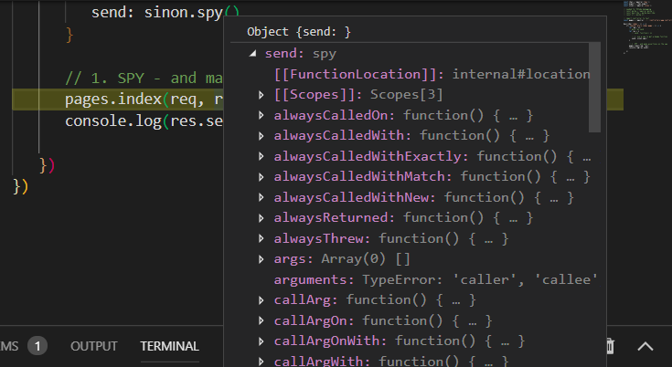

# Mocha test runner

to run
`$ mocha tests/`
or
`$ mocha tests/**/*.*`

! don't use arrow functions when 
using the test's context (it)

### Chai is an assertion library

- it uses `expect` and a slightly different syntax

https://devhints.io/chai

### SinonJS provides test spies, stubs, mocks

spy:
- tracks fake/existing functions exec
- tells us how many times function has been called, the arguments passed when it was called, etc
- useful for callbacks

stub:
- replaces functions
- more control by returning whatever we want or have function work in a way that suites our test scenario

mock:
- fake functions 
- pre-programmed behavior and expectation

====

sinon.spy() arguments

